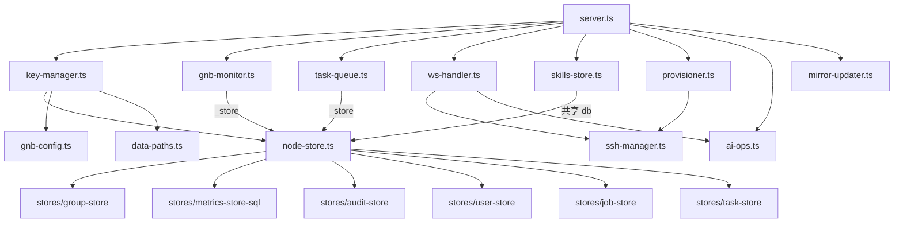

# AGENTS.md — 架构文档

> 每次架构级变更（创建/删除文件、模块重组）后必须同步更新此文件。

## 目录结构

```
opengnb-gui/
├── src/
│   ├── server.ts                         # Express + WS 入口，组装所有服务并启动
│   ├── services/
│   │   ├── data-paths.ts                 # 集中路径管理（data/ 子目录定义）
│   │   ├── key-manager.ts               # 密钥管理 + 节点审批 + GNB address.conf 同步
│   │   ├── gnb-config.ts                # GNB 配置生成器（从 key-manager 提取）
│   │   ├── node-store.ts                # SQLite 数据层（mixin 模式聚合子模块）
│   │   ├── gnb-monitor.ts               # 推模式监控（仅监控，任务队列已提炼到 task-queue）
│   │   ├── task-queue.ts                 # Agent 任务队列管理（从 gnb-monitor 独立）
│   │   ├── skill-command.ts              # 技能安装/卸载命令策略注册表
│   │   ├── gnb-parser.ts                # GNB gnb_ctl 输出解析器
│   │   ├── skills-store.ts              # 技能注册表（共享 DB / 独立 DB 双模式）
│   │   ├── metrics-store.ts             # 指标时序存储 + 趋势聚合
│   │   ├── ssh-manager.ts               # SSH 连接池（通过 GNB TUN）
│   │   ├── provisioner.ts               # 远程部署 OpenClaw + GNB
│   │   ├── job-manager.ts               # 异步任务管理（投递 + 回调 + 超时）
│   │   ├── claw-rpc.ts                  # OpenClaw JSON-RPC 客户端
│   │   ├── ai-ops.ts                    # Claude Code 流式 Chat（安全门控）
│   │   ├── mirror-updater.ts            # 软件镜像自动更新检查
│   │   ├── audit-logger.ts              # 操作审计日志
│   │   ├── ws-handler.ts                # WebSocket 处理（监控/终端/AI 三通道）
│   │   └── logger.ts                    # 日志工厂（带时间戳 + 模块名）
│   ├── stores/                           # NodeStore mixin 子模块
│   │   ├── group-store.ts               # 分组 CRUD
│   │   ├── metrics-store-sql.ts         # 指标预编译语句
│   │   ├── audit-store.ts               # 审计日志预编译语句
│   │   ├── user-store.ts                # 用户认证预编译语句
│   │   ├── job-store.ts                 # Job 预编译语句
│   │   └── task-store.ts                # Agent 任务队列预编译语句（agent_tasks 表）
│   ├── routes/
│   │   ├── enroll.ts                    # 注册审批（enrollToken + flexAuth）
│   │   ├── nodes.ts                     # 节点管理 + 技能安装/卸载（Agent 任务入队）
│   │   ├── auth.ts                      # 登录认证（JWT）
│   │   ├── jobs.ts                      # 异步 Job 回调
│   │   ├── claw.ts                      # OpenClaw 管理
│   │   ├── groups.ts                    # 分组 CRUD 路由
│   │   ├── skills.ts                    # 技能商店 API
│   │   ├── mirror.ts                    # 软件镜像下载
│   │   └── ai.ts                        # AI 运维终端
│   ├── middleware/
│   │   ├── auth.ts                      # JWT + apiToken 双模认证
│   │   ├── error-handler.ts             # 全局错误处理
│   │   └── rate-limit.ts                # 速率限制
│   ├── client/                           # 前端 SPA（Vite ESM 构建）
│   │   ├── main.ts                      # 入口 + window 全局挂载
│   │   ├── core.ts                      # 状态管理 + Hash 路由
│   │   ├── ws.ts                        # WebSocket 客户端
│   │   ├── modal.ts                     # 弹窗组件
│   │   ├── utils.ts                     # DOM/格式/Toast 工具
│   │   ├── pages/                       # 页面路由
│   │   │   ├── dashboard.ts             # 仪表盘
│   │   │   ├── nodes.ts                 # 节点管理
│   │   │   ├── users.ts                 # 团队管理
│   │   │   ├── settings.ts              # 系统设置
│   │   │   ├── groups.ts                # 分组管理
│   │   │   └── skills.ts                # 技能商店
│   │   └── components/                  # UI 组件
│   │       ├── node-detail-panel.ts     # 节点详情展开面板（含任务队列 UI）
│   │       └── skill-modals.ts          # 技能安装/卸载弹窗
│   └── types/
│       ├── global.d.ts                  # 全局类型声明
│       └── interfaces.ts                # 核心数据接口
├── scripts/
│   ├── init-db.ts                       # 数据库 schema 幂等初始化 + 旧 DB 迁移
│   ├── deploy.sh                        # 增量部署（git + init-db + systemd restart）
│   ├── initnode.sh                      # 节点初始化（10 步）
│   ├── node-agent.sh                    # 节点 Agent（10s 心跳 + 任务执行）
│   ├── setup-console.sh                 # Console 一键部署
│   ├── sync-mirror.sh                   # 镜像同步
│   └── pack-openclaw.sh                 # OpenClaw 打包
└── data/                                # 运行时数据（自动创建）
    ├── registry/nodes.db                # 唯一 SQLite 主库（9 表）
    ├── security/ssh/                    # ED25519 密钥对
    ├── logs/ops/                        # 运维日志
    └── mirror/                          # 二进制镜像
```

## 模块依赖关系



## 数据库 Schema（data/registry/nodes.db）

| 表 | 职责 | 主键 |
|----|------|------|
| `nodes` | 节点元数据 | `id TEXT` |
| `groups` | 节点分组 | `id TEXT` |
| `metrics` | 时序指标 | `(nodeId, ts)` |
| `audit_logs` | 审计日志 | `id INTEGER AUTOINCREMENT` |
| `users` | 管理员账户 | `id TEXT` |
| `jobs` | 异步 SSH 任务 | `id TEXT` |
| `agent_tasks` | Agent 任务队列 | `taskId TEXT` |
| `skills` | 技能注册表 | `id TEXT` |

## Agent 任务队列数据流

```
前端 POST /skills → nodes.ts 入队 → gnb-monitor.enqueueTask()
                                          ↓ SQLite INSERT
Agent 心跳 POST /report → server.ts → gnb-monitor.getPendingTasks()
                                          ↓ 响应体 tasks[]
Agent 执行命令 → 下次心跳上报 taskResults → gnb-monitor.processTaskResults()
                                          ↓ SQLite UPDATE
前端 GET /tasks → gnb-monitor.getNodeTasks() → 任务列表 UI
```

## 部署流程

```
deploy.sh:
  1. git push → 远程 git reset --hard
  2. npm install → npm run build → npm rebuild
  3. npx tsx scripts/init-db.ts  ← schema 迁移（先于服务启动）
  4. systemctl restart gnb-console (TimeoutStopSec=10)
  5. nginx + HTTPS 证书
```

## 关键设计决策

| 决策 | 原因 |
|------|------|
| **单一 SQLite DB** | 消除多 DB 同步问题，WAL 模式支持读写并发 |
| **init-db.ts 独立于应用** | 解耦 schema 迁移与运行时，deploy 时先迁移再启动 |
| **NodeStore mixin 模式** | `stores/` 子模块提供 statements + methods，`Object.assign` 混入 prototype |
| **SkillsStore 共享 DB** | 接受 `NodeStore.db` 实例，不再独立打开文件 |
| **Agent piggyback 模式** | 任务随心跳响应下发，无需额外通道 |
| **SIGTERM 优雅关闭** | 先 terminate WS → server.close → 5s 强制退出兜底 |
